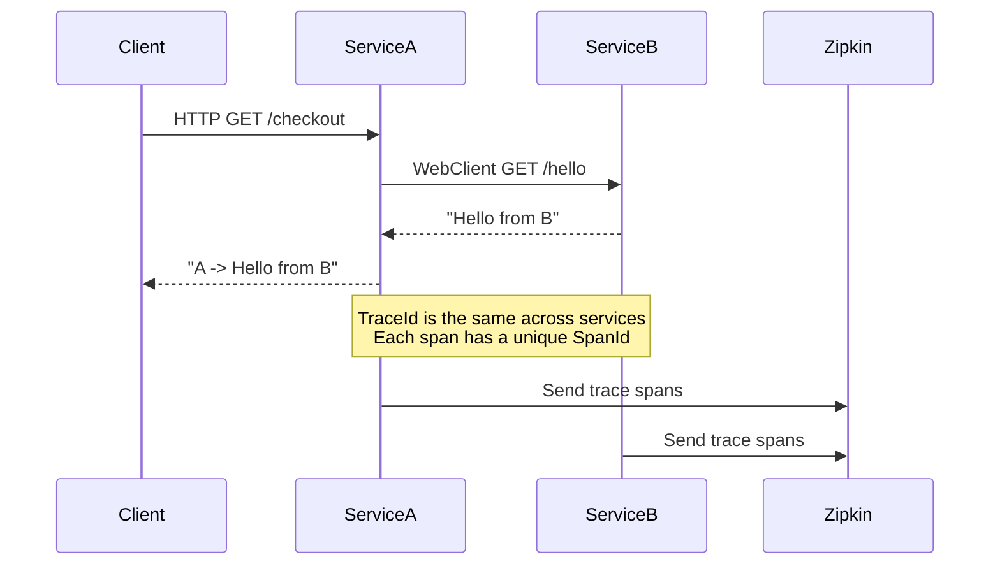

# 📌 Distributed Tracing Demo with Spring Boot 3, WebClient & Zipkin

This project demonstrates **Distributed Tracing** in a microservices architecture using:

- **Spring Boot 3.3.x**
- **WebClient (Reactive HTTP Client)**
- **Micrometer Tracing (Brave)**
- **Zipkin (for trace visualization)**

Two services are implemented:

- **Service A (port 8080)** → entrypoint service, calls Service B using WebClient  
- **Service B (port 8081)** → downstream service, returns a simple response  

All requests are traced with **Trace ID** and **Span ID**, propagated automatically across services.

---

## 🏗️ Architecture



🚀 Technologies

- Spring Boot 3.3.x

- Spring Web (Service B - REST API)

- Spring WebFlux (Service A - WebClient)

- Spring Boot Actuator (metrics & health)

- Micrometer Tracing + Brave Bridge (distributed tracing)

- Zipkin Reporter (send traces to Zipkin)

- Gradle (build tool)

- Docker (run Zipkin server)

⚙️ Setup

1. Run Zipkin (via Docker)

```
docker run -d -p 9411:9411 --name zipkin openzipkin/zipkin
```
2. Run Service B
3. Run Service A

▶️ Usage
Call the API through Service A:

```
curl http://localhost:8080/checkout
```